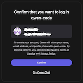

# 身份验证设置

Wucai Code支持多种身份验证方式，您可以根据需要选择最适合的方式。

## 认证方式对比

| 方式 | 费用 | 请求限制 | 设置难度 | 推荐度 |
|------|------|----------|----------|--------|
| API密钥 | 按量计费 | 无限制 | 中等 | ⭐⭐⭐⭐ |
| Qwen OAuth | 免费 | 2000次/天 | 简单 | ⭐⭐⭐⭐⭐ |

## 方法一：API密钥
### 优势
- ✅ 无限制请求
- ✅ API Key永久有效

1. **启动Wucai Code**
   ```bash
   wucai
   ```

   初次启动时界面如下：
   

2. **选择DASHSCOPE_API_KEY环境变量(阿里云百炼认证)**

   按Enter键进行设置认证，在API Key的输入框中输入正确的阿里云百炼API Key信息：
    
   输入正确信息后，Wucai Code即可正常使用
    
   **注意:** 以上方式设置的API Key是临时变量，重新启动Wucai Code时仍然会被要求重新设置API Key。
   
   建议用户参考阅读 [设置阿里云百炼](/zh/user-guide/authentication.md#阿里云百炼) ，正确设置永久环境变量：
   ```bash
   DASHSCOPE_API_KEY={your_api_key}
   ```
   

## 方法二：Qwen OAuth

### 优势
- ✅ 完全免费
- ✅ 每天2000次请求
- ✅ 自动凭证管理
- ✅ 零配置要求

### 设置步骤
1. **启动Wucai Code**
   ```bash
   wucai
   ```
   初次启动时界面如下：
   
   

2. **选择Qwen OAuth认证**

   按⬇️键选择**Qwen OAuth**后按Enter键，当选择Qwen OAuth方式认证时，在字符终端界面中会显示二维码如下，可以使用支付宝或微信扫码登录：

   

   同时，程序会自动打开浏览器进行认证，可以进行登录或注册。
   
   
   如百炼账号已经关联Google或GitHub账号，可以直接按确认登录:
   
   🌟注意：请先确认网络链接稳定后再访问
   

   确认授权Wucai Code访问

   

   认证完成后返回终端，Wucai Code即可正常使用

    


### 使用示例
```bash
> 你好，请帮我写一个Python函数
```


## 支持的API提供商

### 中国大陆用户

**选项1：阿里云百炼**
- 申请地址：[阿里云百炼控制台](https://bailian.console.aliyun.com/)
- 配置示例：
  ```bash
  export OPENAI_API_KEY="your_api_key_here"
  export OPENAI_BASE_URL="https://dashscope.aliyuncs.com/compatible-mode/v1"
  export OPENAI_MODEL="qwen3-coder-plus"
  ```

**选项2：ModelScope（免费）**
- 申请地址：[ModelScope API](https://modelscope.cn/docs/model-service/API-Inference/intro)
- 每天2000次免费调用
- 配置示例：
  ```bash
  export OPENAI_API_KEY="your_api_key_here"
  export OPENAI_BASE_URL="https://api-inference.modelscope.cn/v1"
  export OPENAI_MODEL="Qwen/Qwen3-Coder-480B-A35B-Instruct"
  ```

### 国际用户

**选项1：阿里云ModelStudio**
- 申请地址：[ModelStudio控制台](https://modelstudio.console.alibabacloud.com/)
- 配置示例：
  ```bash
  export OPENAI_API_KEY="your_api_key_here"
  export OPENAI_BASE_URL="https://dashscope-intl.aliyuncs.com/compatible-mode/v1"
  export OPENAI_MODEL="qwen3-coder-plus"
  ```

**选项2：OpenRouter**
- 申请地址：[OpenRouter](https://openrouter.ai/)
- 提供免费层级
- 配置示例：
  ```bash
  export OPENAI_API_KEY="your_api_key_here"
  export OPENAI_BASE_URL="https://openrouter.ai/api/v1"
  export OPENAI_MODEL="qwen/qwen3-coder:free"
  ```

### 配置方法

**方法1：环境变量**
```bash
# Windows (PowerShell)
$env:OPENAI_API_KEY="your_api_key_here"
$env:OPENAI_BASE_URL="your_base_url"
$env:OPENAI_MODEL="your_model"

# macOS/Linux
export OPENAI_API_KEY="your_api_key_here"
export OPENAI_BASE_URL="your_base_url"
export OPENAI_MODEL="your_model"
```

**方法2：.env文件**
在项目根目录创建 `.env` 文件：
```env
OPENAI_API_KEY=your_api_key_here
OPENAI_BASE_URL=your_base_url
OPENAI_MODEL=your_model
```
**方法3：用户配置文件**
在 `~/.wucai/settings.json` 中配置：
```json
{
  "auth": {
    "type": "openai",
    "apiKey": "your_api_key_here",
    "baseUrl": "your_base_url",
    "model": "your_model"
  }
}
```

## 切换认证方式

### 从API密钥切换到OAuth
```bash
> /auth
```
选择OAuth认证方式

### 从OAuth切换到API密钥
1. 设置环境变量或配置文件
2. 重启Wucai Code
3. 系统会自动检测并使用API密钥

## 验证认证状态

### 检查当前认证方式
```bash
> /auth
```

### 测试API连接
```bash
> 请简单介绍一下你自己
```

## 常见问题

### Q: OAuth认证失败怎么办？
A: 
1. 检查网络连接
2. 确保浏览器支持JavaScript
3. 清除浏览器缓存后重试

### Q: API密钥无效？
A: 
1. 检查密钥是否正确
2. 确认API服务商账户状态
3. 验证网络连接和防火墙设置

### Q: 如何查看使用量？
A: 使用 `/stats` 命令查看当前会话的令牌使用情况

### Q: 可以同时使用多种认证方式吗？
A: 不可以，系统会优先使用API密钥，如果没有则使用OAuth

## 安全建议

1. **保护API密钥**
   - 不要将密钥提交到代码仓库
   - 使用环境变量或配置文件
   - 定期轮换密钥

2. **网络安全**
   - 使用HTTPS连接
   - 避免在公共网络输入敏感信息

3. **账户安全**
   - 使用强密码
   - 启用双因素认证（如果支持）

## 下一步

认证设置完成后，您可以：

- [学习基础使用](/zh/user-guide/basic-usage)
- [查看命令参考](/zh/user-guide/commands)
- [尝试编程任务示例](/zh/examples/programming-tasks)
